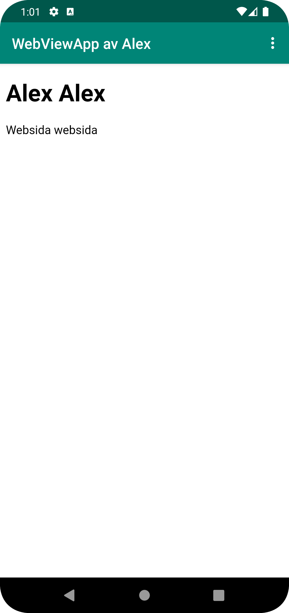

# Rapport

Appens namn ändrades i strings.xml till "WebView av Alex"
<string name="app_name">WebViewApp av Alex</string>

Nödvändiga import för WebView importerades i MainActivity.java
import android.webkit.WebView;
import android.webkit.WebViewClient;

private variabel av typen webView skapdes i MainActivity
private WebView myWebView;

La till Internetåtkomstbehörigheten i AndroidManifest.xml
<uses-permission android:name="android.permission.INTERNET" />

Bytte ut TextView i activity_main.xml med en WebView.

<WebView
android:id="@+id/my_webview"
android:layout_width="match_parent"
android:layout_height="match_parent"
app:layout_constraintTop_toBottomOf="@+id/appBarLayout"
app:layout_constraintBottom_toBottomOf="parent"
app:layout_constraintStart_toStartOf="parent"
app:layout_constraintEnd_toEndOf="parent" />

myWebView initierades och ändrades i OnCreate metoden i MainActivity, för att kunna annvända WebViewClient och för att kunna aktivera JavaScript

@Override
protected void onCreate(Bundle savedInstanceState) {
super.onCreate(savedInstanceState);
setContentView(R.layout.activity_main);
myWebView = findViewById(R.id.my_webview);
myWebView.setWebViewClient(new WebViewClient());
myWebView.getSettings().setJavaScriptEnabled(true);
}

En HTML-sida skapdes och las in i assets mappen. 

<!DOCTYPE html>
<html lang="sv">
<head>
    <meta charset="UTF-8">
    <meta name="viewport" content="width=device-width, initial-scale=1.0">
    <title>Exempelsida</title>
</head>
<body>
<h1>Alex Alex</h1>

Websida websida

</body>
</html>

ShowExternalWebPage och showInternalWebpage metoderna ändrades för att hantera externa och interna sidor.
public void showExternalWebPage(){
myWebView.loadUrl("https://student.his.se");
}

public void showInternalWebPage(){
myWebView.loadUrl("file:///android_asset/websida.HTML");
}

OnOptionsItemSelected metoden ändrades för att visa webbsidor av användarens val.
@Override
public boolean onOptionsItemSelected(MenuItem item) {
int id = item.getItemId();

    if (id == R.id.action_external_web) {
        showExternalWebPage();
        return true;
    }

    if (id == R.id.action_internal_web) {
        showInternalWebPage();
        return true;
    }

    return super.onOptionsItemSelected(item);
}

